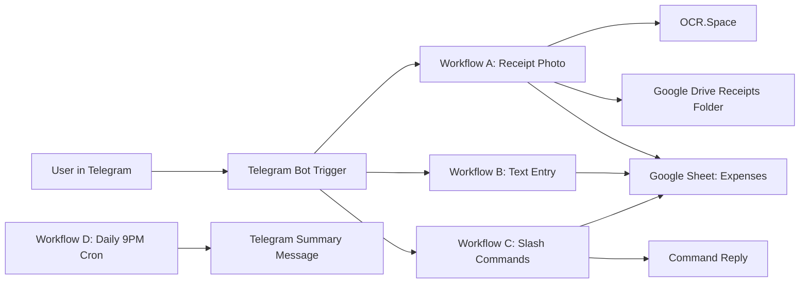

# Fintrak Vault Home

This Obsidian vault documents the Fintrak project architecture and the work completed through `2026-05-10`.

## Start Here

- [[01 - System Architecture]]
- [[02 - Workflow Map]]
- [[03 - Setup and Deployment Architecture]]
- [[04 - Data Model and Sheet Schema]]
- [[05 - Commands and Parsing Rules]]
- [[06 - Work Done Timeline]]
- [[07 - Risks and Improvement Backlog]]

## Project Snapshot

- Project type: Self-hosted automation stack (n8n + Telegram + Google Sheets + Google Drive + OCR.Space)
- Primary runtime: n8n (`docker-compose.yml`) or local n8n process on Android/Termux
- Main automation assets: `n8n-workflows/workflow-*.json`
- Setup entry points: `setup.sh`, `setup.ps1`, `setup-android.sh`, `setup.bat`

## End-to-End Flow

## Note

This documentation is generated from current repository files and git history, not from runtime telemetry.
