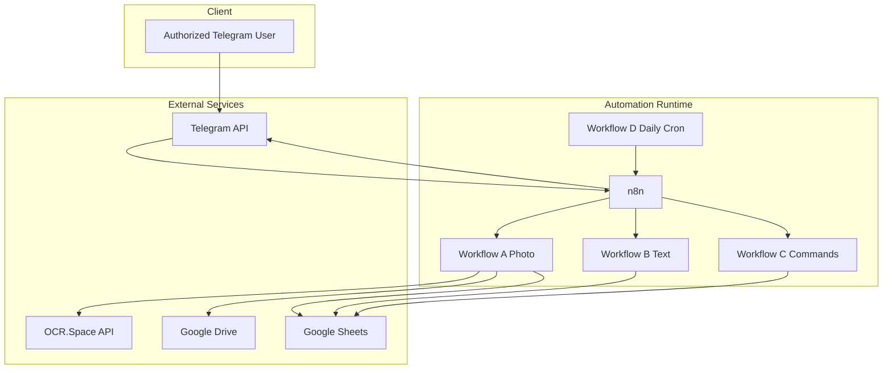

# System Architecture

## Core Components

1. Telegram Bot Interface
- Source: n8n Telegram Trigger and Telegram nodes across workflows.
- Role: User input channel for photos, text entries, and slash commands.

2. Workflow Engine (n8n)
- Source: `docker-compose.yml` (containerized) and `setup-android.sh` (local n8n on Termux).
- Role: Event orchestration and business logic execution.

3. OCR Service (OCR.Space)
- Source: `workflow-a-receipt.json` HTTP request node.
- Role: Extract receipt text from image uploads.

4. Storage Layer (Google Drive + Google Sheets)
- Source: workflows A/B/C/D + setup workflow.
- Role:
  - Drive stores receipt images.
  - Sheets stores normalized expense records and supports reporting reads.

5. Setup Automation Layer
- Source: `setup.sh`, `setup.ps1`, `setup-android.sh`, `workflow-setup.json`.
- Role: Provision credentials, resources, and activate automations.

## Architectural Style

- Event-driven workflow orchestration.
- Stateless processing per message/event, with persisted state in Google Sheets.
- Security gate at workflow ingress using Telegram chat ID match.

## Runtime Topology

## Security and Access Boundaries

- Primary access control: `YOUR_TELEGRAM_CHAT_ID` compared in guard nodes.
- Credential storage:
  - `.env` for setup-level values.
  - n8n credential store for Telegram/Google integrations.
- Data ownership model: user-owned Google account (Sheet + Drive).
